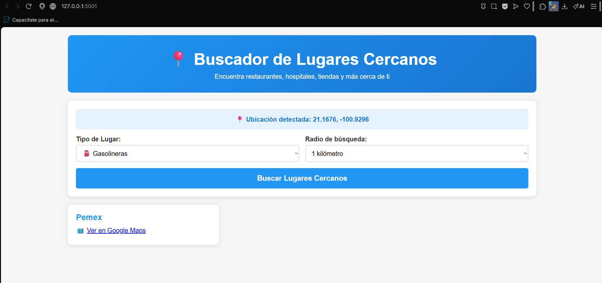
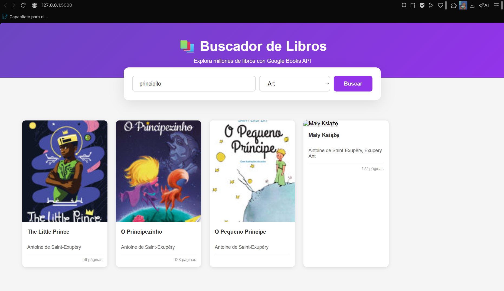
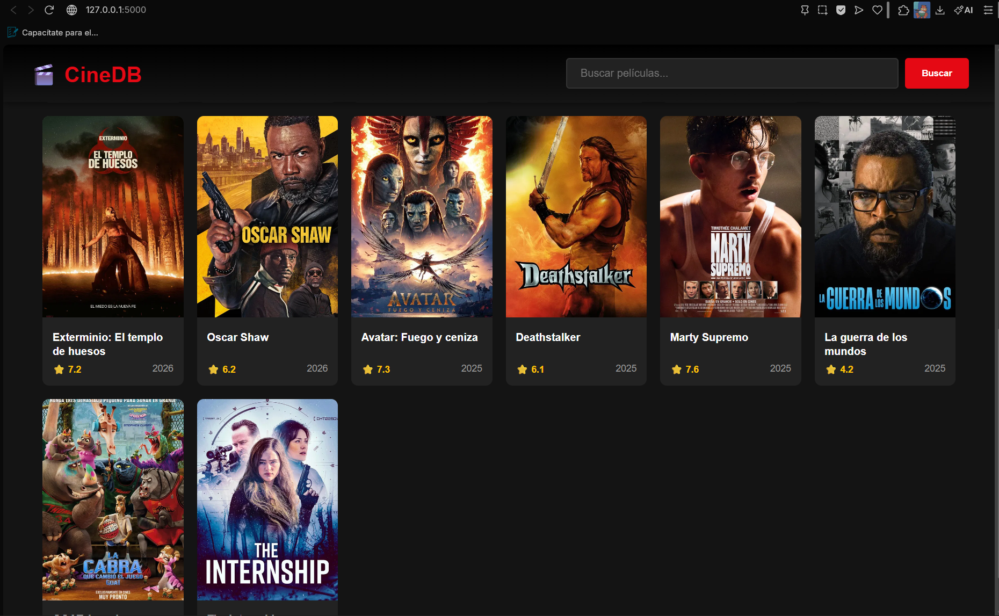

# 🗂️ Ejercicios-APIS

Colección de mini aplicaciones construidas con Flask que consumen diferentes APIs.

---

## 📁 Estructura del Proyecto

```
Ejercicios-APIS/
├── chat_app.py
├── clima_app.py
├── divisas_app.py
├── github_app.py
├── libros_app.py
├── lugares_app.py
├── peliculas_app.py
├── productos_api.py
├── productos.db
├── reddit_app.py
├── requirements.txt
└── templates/
    ├── chat.html
    ├── clima.html
    ├── divisas.html
    ├── github.html
    ├── libros.html
    ├── lugares.html
    ├── peliculas.html
    ├── productos.html
    └── reddit.html
```

---

## 🐍 Archivos Python (Backend)

| Archivo | Descripción |
|--------|-------------|
| [`chat_app.py`](Ejercicios-APIS/chat_app.py) | Aplicación de chat |
| [`clima_app.py`](Ejercicios-APIS/clima_app.py) | Consulta del clima |
| [`divisas_app.py`](Ejercicios-APIS/divisas_app.py) | Conversión de divisas |
| [`github_app.py`](Ejercicios-APIS/github_app.py) | Búsqueda en GitHub |
| [`libros_app.py`](Ejercicios-APIS/libros_app.py) | Búsqueda de libros |
| [`lugares_app.py`](Ejercicios-APIS/lugares_app.py) | Búsqueda de lugares |
| [`peliculas_app.py`](Ejercicios-APIS/peliculas_app.py) | Búsqueda de películas |
| [`productos_api.py`](Ejercicios-APIS/productos_api.py) | API de productos |
| [`reddit_app.py`](Ejercicios-APIS/reddit_app.py) | Consulta de Reddit |

---

## 🌐 Archivos HTML (Frontend)

> Ubicados en la carpeta `templates/`

| Archivo | Descripción |
|--------|-------------|
| [`templates/chat.html`](templates/chat.html) | Interfaz de chat |
| [`templates/clima.html`](templates/clima.html) | Interfaz del clima |
| [`templates/divisas.html`](templates/divisas.html) | Interfaz de divisas |
| [`templates/github.html`](templates/github.html) | Interfaz de GitHub |
| [`templates/libros.html`](templates/libros.html) | Interfaz de libros |
| [`templates/lugares.html`](templates/lugares.html) | Interfaz de lugares |
| [`templates/peliculas.html`](templates/peliculas.html) | Interfaz de películas |
| [`templates/productos.html`](templates/productos.html) | Interfaz de productos |
| [`templates/reddit.html`](templates/reddit.html) | Interfaz de Reddit |

---


## Evidencias

| Evidencia 1 | Evidencia 2 |
| :---: | :---: |
|  |  |
| **Evidencia 3** | **Evidencia 4** |
|  |  |
| **Evidencia 5** | **Evidencia 6** |
|  |  |
| **Evidencia 7** | **Evidencia 8** |
|  |  |
| **Evidencia 9** | **Evidencia 10** |
|  |  |
